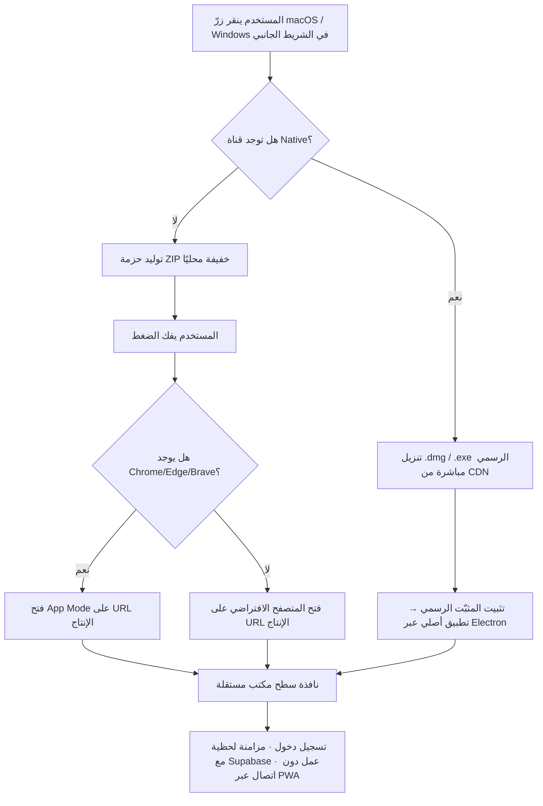

# دليل النسخة المكتبية لنظام حاضر

> الإصدار الحالي للوثيقة: 2026-05 · ينطبق على نسخة `1.0.x` فما فوق
> نقطة الدخول في الواجهة: زرّا **macOS / Windows** أسفل الشريط الجانبي
> الخدمات الأساسية:
> - `services/downloadService.ts` — orchestration للقناتين (Lightweight / Native)
> - `services/desktop/icns.ts` — مولّد أيقونات `.icns` و `.ico` متعدّدة الأحجام
> - `services/desktop/macAppBundle.ts` — توليد `.app` كامل (Info.plist + binary + Resources)
> - `services/desktop/windowsLauncher.ts` — مشغّل صامت `.vbs` + سكربت اختصار + أيقونة `.ico`
> - `services/desktop/welcomePage.ts` — صفحة ترحيب احترافية مدمجة
> - `services/desktopBuildInfo.ts` — بصمة Build ثابتة (FNV-1a)
> - `services/desktopReleaseChecker.ts` — اكتشاف القناة الـ Native عند توفّرها
> - `services/desktopAutoUpdate.ts` — فحص توفّر إصدار جديد للنسخة المكتبية

---

## 1. لمحة سريعة

تطبيق "نظام حاضر" متاح كنسخة سطح مكتب عبر **قناتين مكمّلتين**:

| القناة | متى تُستخدم | الناتج | المتطلبات |
|--------|-------------|--------|-----------|
| **Lightweight (App-Mode Wrapper)** | الوضع الافتراضي · متاح دائمًا | حزمة ZIP بها مشغّل (`Hader.app` / `Hader.vbs` + `Hader.bat`) يفتح التطبيق في نافذة Chrome/Edge في وضع App Mode | متصفح Chromium (Chrome 100+ · Edge 110+ · Brave · Vivaldi · Arc) |
| **Native (Electron Build)** | عند نشر `VITE_DESKTOP_RELEASE_URL` يحتوي على روابط `.dmg` و `.exe` المُولَّدة بـ `electron-builder` | المثبّت الرسمي يُحمَّل مباشرة من الخادم (لا توليد ZIP محليًا) | متطلبات نظام التشغيل المعتاد للمثبّتات الموقّعة |

كلتا القناتين **متّصلتان بنفس قاعدة بيانات Supabase** التي تستخدمها النسخة
السحابية، ومتوافقتان مع المزامنة اللحظية، الإشعارات، طبقة الـ Realtime،
والقفل الموزّع، بدون أي تعديل في الكود.

---

## 2. لماذا تم التغيير؟

النسخة السابقة من `downloadService.ts` كانت تُولّد ZIP يحتوي على:

- ملفات إعداد فقط (`vite.config.ts`، `tailwind.config.cjs`، `package.json` فارغ
  من المكتبات الفعلية).
- ملف `.env` يحوي **مفاتيح Supabase الكاملة** بصيغة `VITE_SUPABASE_ANON_KEY=…`.
- مشغّل (`Hader.command` / `Hader.bat`) ينفّذ `npm install && npm run dev`.

كان هناك ثلاث مشاكل قاتلة:

1. **التطبيق لا يعمل**: المشغّل يحاول تشغيل `npm run dev` لكن لا يوجد
   كود مصدري داخل الحزمة (لا `src/`, لا `components/`, لا `pages/`).
   `INSTALL_NOTE.txt` يعترف صراحة بأن المستخدم "يحتاج لنسخ الكود المصدري بنفسه".
2. **مخاطرة أمنية**: أي مستخدم بصلاحية SCHOOL_ADMIN يمكنه تنزيل ZIP
   يحوي مفتاح Supabase Anon Key كاملًا. هذا غير مقبول في بيئات الإنتاج.
3. **لا مزامنة ولا تحديث تلقائي**: حتى لو نجح التشغيل، التطبيق ينطلق على
   `localhost:5173` ويشغّل dev server محلي يتطلب تحديثًا يدويًا للكود.

النسخة الجديدة تحلّ المشاكل الثلاث في خطوة واحدة عبر نهج **App-Mode Wrapper**.

---

## 3. كيف يعمل المشغّل الذكي (Lightweight)؟

### بنية الحزمة (الترقية الجديدة)

#### macOS — `.app` Bundle حقيقي 🍎
```
Hader-Desktop-Mac.zip
└── Hader-Desktop-Mac/
    ├── Hader.app/                   ← يبدو كتطبيق أصلي في Finder
    │   └── Contents/
    │       ├── Info.plist           ← Bundle ID, Display Name, Version
    │       ├── PkgInfo              ← APPL???? (Launch Services hint)
    │       ├── MacOS/
    │       │   └── Hader            ← POSIX-executable shell launcher (+x)
    │       └── Resources/
    │           ├── icon.icns        ← أيقونة متعدّدة الأحجام (128/256/512/1024)
    │           └── launch.command   ← مشغّل احتياطي
    ├── Open-In-Browser.html         ← صفحة ترحيب احترافية (welcome)
    ├── README.md                    ← دليل المستخدم
    └── version.json                 ← بصمة الـ build + iconEmbedded flag
```

**ميزات Mac الجديدة**:
- ✅ يبدو كتطبيق أصلي في Finder (لا ملف نصي)
- ✅ سحب-وإفلات إلى `/Applications`
- ✅ يفتح بنقرة واحدة دون أي نافذة Terminal
- ✅ أيقونة حادّة بكل أحجام Dock / Spotlight / Mission Control
- ✅ مدعوم بـ Spotlight + بصمة Bundle ID رسمية (`sa.hader.lightweight`)

#### Windows — مشغّل صامت + اختصار ذكي 🪟
```
Hader-Desktop-Windows.zip
└── Hader-Desktop-Windows/
    ├── Hader.vbs                    ← مشغّل صامت (لا تظهر نافذة CMD)
    ├── Hader.bat                    ← المحرّك الفعلي + سجلّ تشخيصي
    ├── Hader.ico                    ← أيقونة متعدّدة الأحجام (16-256)
    ├── Install-Shortcut.bat         ← يُنشئ اختصارًا على Desktop + Start Menu
    ├── Open-In-Browser.html
    ├── README.md
    └── version.json
```

**ميزات Windows الجديدة**:
- ✅ تشغيل صامت تمامًا (لا فلاش لـ cmd window)
- ✅ اختصار "Hader" حقيقي في Desktop + Start Menu بأيقونة `.ico` ملوّنة
- ✅ سجل تشخيصي محلي في `%LOCALAPPDATA%\Hader\launcher.log`
- ✅ يدعم Pin to Taskbar مع الأيقونة الصحيحة

أصغر حجمًا من 50 KB (مع الأيقونات)، ولا يحتوي على أي مفتاح أو بيانات حساسة.

### آلية التشغيل (Pre-flight + Smart Launch)

1. ينقر المستخدم على `Hader.app` (Mac) أو `Hader.vbs` (Windows).
2. الـ launcher يفتح سجلًّا محليًّا (`launcher.log`) ويُسجِّل وقت التشغيل وحالة
   الاتصال — مفيد جدًا للدعم الفني.
3. يكتشف ترتيبيًا أوّل متصفح Chromium مثبّت
   (`Chrome → Edge → Brave → Vivaldi → Arc` على Mac · ومسارات Program Files
   و LocalAppData على Windows).
4. يفتح المتصفح في وضع **App Mode** عبر الأعلام:
   ```
   chrome --app=https://hader.example.com/ \
          --user-data-dir="$HOME/Library/Application Support/Hader/AppMode" \
          --no-first-run \
          --no-default-browser-check \
          --disable-features=TranslateUI \
          --window-size=1400,900
   ```
5. عند غياب أي متصفح Chromium، يتم تنبيه المستخدم عبر `osascript` (macOS)
   أو السقوط لصفحة `Open-In-Browser.html` المرحّبة (Windows).
6. ملف تعريف المتصفح المخصّص يُحفظ محليًا، فيتذكّر تسجيل الدخول وإعدادات
   PWA و IndexedDB بين مرّات التشغيل.

### الفوائد

- **مزامنة فورية**: كل التغييرات (طلاب، حضور، إشعارات) تنعكس فورًا في
  النسخة السحابية والأجهزة الأخرى عبر Supabase Realtime.
- **تحديثات تلقائية للمحتوى**: المتصفح يجلب أحدث `index.html` من الخادم.
- **تحديثات للمشغّل نفسه**: واجهة Hader تفحص `desktop/version.json` كل ست
  ساعات وتُظهر شارة "v… متاحة" في الشريط الجانبي عند توفّر إصدار جديد.
- **يعمل دون اتصال**: بفضل Service Worker الخاص بـ PWA يبقى التطبيق
  متاحًا حتى عند انقطاع الإنترنت، ويزامن التغييرات لاحقًا.
- **حجم تنزيل صغير جدًا**: ~50 KB مع الأيقونات.
- **بدون أسرار**: لا يحوي مفاتيح Supabase أو أي بيانات حساسة.
- **تشخيص محلي**: سجلّ `launcher.log` يحتوي على معلومات التشخيص.

### القيود

- يحتاج المستخدم متصفح Chromium حديثًا للحصول على نافذة App Mode.
  بدونه يفتح صفحة الترحيب التي تنقل إلى التطبيق في المتصفح الافتراضي.
- على macOS قد يطلب Gatekeeper تأكيد الفتح أوّل مرّة (التطبيق غير مُوقّع).
  الحل: System Settings → Privacy & Security → "افتح على أي حال".
- على Windows قد يحذّر SmartScreen من `.vbs` أوّل مرّة. الحل: "More info"
  → "Run anyway".

---

## 4. كيف تفعّل قناة Native (Electron)؟

### الخطوة 1: بناء المثبّتات

```bash
# على macOS — يبني .dmg و .zip
npm run electron:build:mac

# على Windows — يبني NSIS installer + portable
npm run electron:build:win

# لكلا المنصّتين معًا (يتطلب macOS + الأدوات المتقاطعة)
npm run electron:build:all
```

تُحفظ المخرجات في `release/`. على سبيل المثال:

```
release/
  Hader System-1.0.0-mac-universal.dmg
  Hader System-1.0.0-mac-universal.zip
  Hader System-1.0.0-Setup.exe
  Hader System-1.0.0-Portable.exe
```

### الخطوة 2: نشر المنتجات على CDN / GitHub Releases

أيّ خدمة تخزين تخدم بـ HTTPS تكفي. الحدّ الأدنى المطلوب: ملف JSON واحد
بصيغة:

```jsonc
// /desktop/manifest.json
{
  "version": "1.0.0",
  "releasedAt": "2026-05-05T10:00:00Z",
  "notesUrl": "https://github.com/<org>/<repo>/releases/tag/v1.0.0",
  "platforms": {
    "mac": {
      "url": "https://cdn.example.com/Hader-1.0.0-mac-universal.dmg",
      "size": 102400000,
      "sha256": "<hex>",
      "arch": ["x64", "arm64"],
      "format": "dmg"
    },
    "windows": {
      "url": "https://cdn.example.com/Hader-1.0.0-Setup.exe",
      "size": 95000000,
      "sha256": "<hex>",
      "arch": ["x64"],
      "format": "nsis"
    }
  }
}
```

### الخطوة 3: ضبط متغيرات البيئة

في `.env` أو في إعدادات النشر (Vercel/Netlify/Cloudflare):

```ini
VITE_APP_URL=https://your-production-domain.example
VITE_DESKTOP_RELEASE_URL=https://your-production-domain.example/api/desktop-release
```

`VITE_APP_URL` هو الرابط الذي ستفتحه حزم macOS/Windows. عند تركه فارغًا
تستخدم الحزمة الـ origin الحالي. أثناء التطوير المحلي يفضّل ضبطه على رابط
الإنتاج حتى لا تُنشأ حزمة مرتبطة بـ `127.0.0.1`.

بمجرد إعادة النشر، أزرار التحميل ستكتشف الـ manifest وتفضّل المثبّت
الرسمي تلقائيًا. عند تعطّل الكشف (انقطاع شبكة، manifest غير صالح،
أصل غير مدعوم) يتم الرجوع التلقائي إلى المشغّل الذكي.

### الخطوة 4: التحقق من النشر

افتح صفحة Diagnostics في التطبيق. سترى ضمن قسم "Desktop Releases":

- **Channel detected**: `native`
- **Manifest URL**: `https://cdn.example.com/desktop/manifest.json`
- **Latest version**: `1.0.0`
- **Cache TTL**: 10 دقائق

يمكن مسح ذاكرة التخزين يدويًا عبر:

```js
import { clearReleaseManifestCache } from './services/desktopReleaseChecker';
clearReleaseManifestCache();
```

---

## 5. تدفّق العمل من وجهة نظر المستخدم



---

## 6. ضمان الجودة والأمان

### اختبارات وحدوية (13 اختبار، يمر 100%)

ملف `__tests__/desktop-download.spec.ts` يغطي:

1. **هدف مشغّل صالح**: التحقق من أن `hasValidLauncherTarget()` يقبل HTTPS
   ويرفض `about:blank` و `data:` و `file://`.
2. **بصمة build مستقرة**: `getBuildId()` ينتج نفس القيمة لنفس
   (URL × version × build-day).
3. **`.app` Bundle حقيقي**: يفحص `Info.plist` لـ `CFBundleIdentifier`،
   `CFBundleExecutable`، `NSHighResolutionCapable`، و `PkgInfo`.
4. **مشغّل Mac POSIX-executable**: يحقّق من shebang، أعلام App Mode،
   مسار profile، واكتشاف Chrome/Edge.
5. **Windows VBScript صامت**: يضمن أن `Hader.vbs` يُشغّل `Hader.bat`
   مع علامة الإخفاء (`0`) ولا يعرض نافذة CMD.
6. **اختصار Windows ذكي**: يفحص أن `Install-Shortcut.bat` يُولّد
   اختصارًا على Desktop + Start Menu بأيقونة `.ico`.
7. **منع تسريب الأسرار**: ينشر مفاتيح Supabase زائفة في `import.meta.env`،
   ثم يفتش جميع ملفات الحزمة المُولَّدة (متجاوزًا الأيقونات الثنائية)
   للتأكّد من عدم ظهورها.
8. **صفحة الترحيب**: redirect يستهدف عنوان الإنتاج، شارة "App-Mode" مرئية.
9. **Native release lookup**: يضمن أن الكشف يقدم خطأ صريحًا عندما لا
   يوجد manifest URL، ويُخزّن الـ manifest في `localStorage` بـ TTL.
10. **Auto-Update probe**: ثلاث حالات — لا مصدر، نسخة محدّثة، نسخة
    أقدم تحتاج تحديث.
11. **مولّد ICNS**: يفحص الـ magic header `icns`، وحجم الإدخال، ونوع
    الإدخال `ic09` (512×512).

تشغيل الاختبارات:

```bash
npx vitest run __tests__/desktop-download.spec.ts
```

### قائمة التحقق قبل الإصدار

- [ ] `VITE_DESKTOP_RELEASE_URL` (اختياري) يعيد JSON صالحًا.
- [ ] `version.json` داخل الحزمة المولَّدة يُظهر الإصدار الحالي.
- [ ] الـ build fingerprint يتغيّر بعد كل نشر جديد لـ `index.html`.
- [ ] فحص يدوي على Mac (Apple Silicon + Intel) و Windows 10/11.
- [ ] يعمل التطبيق بعد ثلاثة أيام من إغلاق الجهاز (لاختبار TTL وذاكرة Cache).
- [ ] يعمل دون اتصال بعد أول تشغيل ناجح (PWA Service Worker).
- [ ] لا توجد أخطاء وحدة Electron الرئيسية في console.

---

## 7. استكشاف الأخطاء الشائعة

| المشكلة | السبب الأرجح | الحل |
|---------|--------------|------|
| الزرّ معطّل | `hasValidLauncherTarget()` رفض الأصل (Local file أو about:blank) | افتح التطبيق من خادم HTTPS عام أو من `https://localhost`. |
| Hader.command لا يفتح | الملف ليس قابلًا للتنفيذ | `chmod +x Hader.command` ثم انقر مرّتين. |
| النافذة تُفتح في tab عادي | المتصفح المثبّت ليس Chromium، أو إصدار قديم | ثبّت Chrome 100+ أو Edge 110+. |
| البيانات لا تتزامن | تسجيل دخول بحساب مختلف، أو IndexedDB محلي تالف | افتح نفس عنوان التطبيق في تبويب عادي وسجّل دخول. عند الحاجة احذف ملف الـ profile في `~/Library/Application Support/Hader/AppMode`. |
| Native channel لا يظهر | `VITE_DESKTOP_RELEASE_URL` غير معرّف، أو الـ manifest غير صالح | افحص الاستجابة في صفحة Network، وتأكّد من توافقها مع المخطط في القسم 4. |
| رسائل تحذير CORS | الـ manifest يُجلب من نطاق خارجي لا يسمح للمتصفح بقراءته | استخدم `/api/desktop-release` من نطاق التطبيق نفسه. |

---

## 8. بصمة الإصدار (Build Fingerprint)

كل حزمة تتضمن `version.json` بالحقول التالية:

```jsonc
{
  "appName": "hader-system",
  "productName": "نظام حاضر",
  "version": "1.0.0",
  "appUrl": "https://hader.sa",
  "launchPath": "/",
  "buildId": "f3a92c01",
  "buildTime": "2026-05-05T15:00:00.000Z",
  "generatedFromUserAgent": "...",
  "features": ["offline-pwa", "auto-update", "sync-supabase", "native-shortcut"],
  "channel": "lightweight",
  "target": "mac",
  "generatedAt": "2026-05-05T15:00:00.000Z"
}
```

استخدامات:

- **الدعم الفني**: عند الإبلاغ عن مشكلة يطلب الفريق `buildId` و `version`
  للتعرّف الفوري على نوع الحزمة المثبّتة.
- **اكتشاف الانحراف**: مقارنة `buildId` بين أجهزة فريق العمل تكشف عن
  مَن لم يحدّث بعد (لو كان الـ buildId مختلفًا).
- **المزامنة**: يمكن لخدمة الإحصائيات إرسال `buildId` ضمن كل event حتى
  يتم ربط البيانات بالحزمة المُنشِئة.

---

## 9. مرجع API

### `services/downloadService.ts`

```ts
type Platform = 'mac' | 'windows';
type DownloadChannel = 'native' | 'lightweight';

interface DownloadOptions {
  preferredChannel?: DownloadChannel;
  onProgress?: (progress: DownloadProgress) => void;
}

interface DownloadResult {
  channel: DownloadChannel;
  filename: string;
  fileSize?: number;
  buildId: string;
  appUrl: string;
  releaseManifestUsed?: boolean;
}

export const downloadDesktopApp:
  (platform: Platform, options?: DownloadOptions) => Promise<DownloadResult>;

export const hasValidLauncherTarget: () => boolean;
export const probeNativeRelease:
  (platform: Platform) => Promise<ReleaseLookupResult>;
```

### `services/desktopBuildInfo.ts`

```ts
export const APP_VERSION: string;
export const APP_URL: string;
export const APP_LAUNCH_PATH: string;
export const DESKTOP_RELEASE_MANIFEST_URL: string;

export function getBuildId(): string;
export function createBuildFingerprint(channel?: DownloadChannel): DesktopBuildFingerprint;
export function getBuildBanner(channel?: DownloadChannel): string;
```

### `services/desktopReleaseChecker.ts`

```ts
export async function lookupNativeRelease(platform: Platform): Promise<ReleaseLookupResult>;
export function startNativeReleaseDownload(asset: NativeReleaseAsset): void;
export function clearReleaseManifestCache(): void;
```

---

## 10. خارطة الطريق

- [x] **اختصار سطح المكتب لـ macOS**: إنشاء حزمة `.app` كاملة مع `Info.plist`
      وأيقونة `.icns` ومشغّل POSIX. *(منجز — ترقية Lightweight 2026-05-05)*
- [x] **مشغّل Windows صامت**: `Hader.vbs` بدلاً من `Hader.bat` لإخفاء نافذة
      CMD، مع `Install-Shortcut.bat` يُنشئ اختصارًا حقيقيًّا بأيقونة. *(منجز)*
- [x] **أيقونات متعدّدة الأحجام**: مولّد `.icns` (16/32/64/128/256/512/1024)
      و `.ico` (16/32/48/64/128/256) مدمج في الحزمة. *(منجز)*
- [x] **Auto-Update Detection**: فحص `desktop/version.json` كل ست ساعات
      وعرض شارة في الشريط الجانبي عند توفّر إصدار جديد. *(منجز)*
- [x] **صفحة ترحيب احترافية**: `Open-In-Browser.html` بتصميم glassmorphism
      مع redirect سلس وبطاقات شفافة. *(منجز)*
- [x] **سجلّ تشخيصي محلّي**: كل launcher يكتب إلى `launcher.log` لتسهيل
      الدعم الفني. *(منجز)*
- [ ] **توقيع رقمي**: ضبط `electron-builder` مع شهادة Apple Developer ID
      وشهادة Authenticode لتجاوز SmartScreen ورفع الثقة على Mac.
- [ ] **التحديث التلقائي للنسخة Native**: تفعيل `electron-updater` مع
      نفس `manifest.json` (`autoUpdater.setFeedURL`).
- [ ] **Linux AppImage** و **Snap**: إضافة هدف Linux إلى electron-builder
      ومانيفست `platforms.linux`.
- [ ] **Telemetry**: إرسال `buildId` و `appUrl` ضمن كل event سرّي بشكل
      مجهّل لتحليل توزيع النسخ.
- [ ] **Native Notifications**: تكامل أعمق مع نظام الإشعارات في
      Mac/Windows عند فتح App Mode (تنبيه عند طلب حضور جديد).

---

*آخر تحديث: 2026-05-05 — ترقية القناة الخفيفة (.app Bundle + VBS Silent + Auto-Update)*
